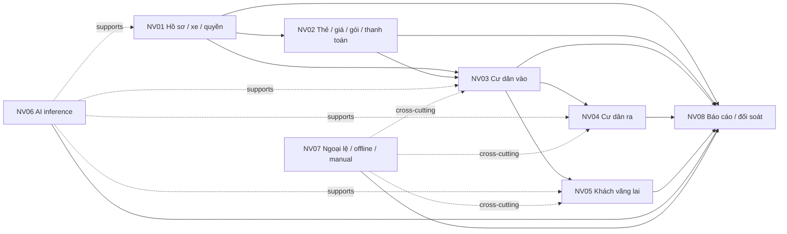

# Business Overview — NV01–NV08

Status: Approved specification materialization  
Source: `CNTT_KLCN101_Tran Van Tho.md`, `Ket_Qua_Khao_Sat_Bai_Xe.md`, `ERD.pdf`  
Implementation status: Approved workflows are not implemented in the current backend skeleton.

## Workflow Index

| Code | Name | Objective | Main actors | Major data | Depends on | Details |
|---|---|---|---|---|---|---|
| NV01 | Đăng ký căn hộ, cư dân và phương tiện | Ghi nhận hộ, cư dân, xe, quyền sử dụng và xác minh ba nguồn ảnh. | Ban quản lý; chủ hộ/thành viên hộ | Apartment, Resident, Membership, Vehicle, Authorization, Media, Verification | Nền hồ sơ | [NV01](nv01-resident-vehicle-registration.md) |
| NV02 | Thẻ, gói gửi xe và thanh toán | Cấp/quản lý thẻ; cấu hình giá; mua/gia hạn gói 30 ngày và ghi nhận thanh toán. | Ban quản lý/nhân viên có quyền; cư dân | Card, Assignment, Pricing, Subscription, Charge, Payment | NV01 | [NV02](nv02-card-subscription-payment.md) |
| NV03 | Cư dân vào bãi | Thu nhận dữ liệu cổng, kiểm tra thẻ/xe/người/gói và quyết định vào. | Nhân viên trạm gác; cư dân | Gate Event, AI inference, Card, Vehicle, Subscription, Parking Session, Barrier Action | NV01–02 | [NV03](nv03-resident-entry.md) |
| NV04 | Cư dân ra bãi | Tìm lượt đang mở, đối chiếu bằng chứng, chốt lượt ra. | Nhân viên trạm gác; cư dân | Gate Event, Parking Session, media, AI inference, Barrier Action | NV03 | [NV04](nv04-resident-exit.md) |
| NV05 | Khách vãng lai gửi xe | Cấp thẻ, ghi lượt, tính phí theo loại xe/thời gian, nhận tiền và đóng lượt. | Nhân viên trạm gác; khách; Ban quản lý với ngoại lệ | Card, Gate Event, Session, Pricing, Charge, Payment | Cổng, pricing, billing | [NV05](nv05-visitor-parking.md) |
| NV06 | AI phân loại phương tiện | Tạo nhận diện biển số, loại xe, khuôn mặt/liveness và confidence hỗ trợ cổng. | AI service; nhân viên trạm gác; backend | AI Inference, media, vehicle family/category, policy thresholds | NV01, NV03–05 | [NV06](nv06-ai-vehicle-classification.md) |
| NV07 | Sự cố và xử lý thủ công | Xử lý ảnh/kết nối không đạt, review, thao tác thủ công và đồng bộ offline. | Nhân viên trạm gác; Ban quản lý; backend/Desktop | Event, Review, Barrier Action, Session, Media, Alert, Sync | NV03–05; tích hợp desktop/API | [NV07](nv07-incident-manual-processing.md) |
| NV08 | Tra cứu, báo cáo và đối soát | Hiển thị lịch sử, vận hành, doanh thu, ngoại lệ và chốt ca. | Ban quản lý; nhân viên trạm gác trong phạm vi ca | Sessions, Events, Media, Charges, Payments, Shifts, Alerts, Audit | Dữ liệu NV01–07 | [NV08](nv08-reporting-reconciliation.md) |

## Dependency Overview

Sơ đồ mô tả phụ thuộc dữ liệu/nghiệp vụ được nêu trong đề cương, survey và ERD; thứ tự triển khai chi tiết nằm ngoài tài liệu nghiệp vụ.
