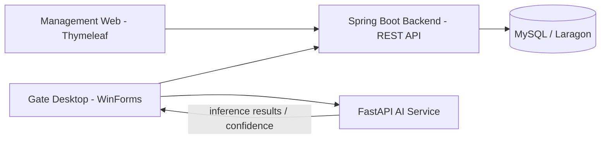

# Smart Parking System Overview

Status: Approved specification materialization  
Source: `CNTT_KLCN101_Tran Van Tho.md`, `Ket_Qua_Khao_Sat_Bai_Xe.md`, repository foundation  
Implementation status: Backend authentication/RBAC, the server-rendered MANAGEMENT Web foundation, and the AHR-03 Apartment, AHR-04 Resident profile, AHR-05 Household Membership, AHR-06 household-head/Apartment lifecycle, AHR-07 Vehicle lookup/OWNER, AHR-08 AUTHORIZED_USER grant/query, AHR-09 VehicleRight lifecycle/guarantor-loss integration, AHR-10 Resident status lifecycle and AHR-11 Membership/VehicleRight VOID API subsets are implemented. The remaining approved NV01–NV08 business workflows are not implemented.

## Project Objective

Nguồn: `CNTT_KLCN101_Tran Van Tho.md` — Mục tiêu §5; Yêu cầu §6.

## Runtime Components

| Thành phần | Vai trò theo nguồn | Hiện trạng repository |
|---|---|---|
| Spring Boot backend | REST API JSON dùng chung; nghiệp vụ, persistence và kết nối Web/Desktop | Authentication/RBAC, REST authentication, MANAGEMENT Web foundation, Apartment and Resident profile APIs, Household Membership lifecycle/head transfer/VOID, Apartment status lifecycle, existing Vehicle lookup/OWNER assignment/transfer, AUTHORIZED_USER grant/query, VehicleRight lifecycle/guarantor-loss/VOID, Resident status lifecycle; remaining NV01–NV08 workflows are not implemented. |
| Thymeleaf Web management | Giao diện Ban quản lý để quản trị, tra cứu, dashboard và báo cáo | Có trang đăng nhập MANAGEMENT, trang home được bảo vệ và trang bảo mật tài khoản; các màn hình nghiệp vụ NV01–NV08 chưa được triển khai. |
| C# .NET WinForms gate desktop | Máy trạm trạm gác; kết nối backend, giao tiếp các luồng tại cổng | WinForms form mẫu; project target hiện tại `net10.0-windows`. |
| Python FastAPI AI service | Dịch vụ AI độc lập cho ANPR/OCR, phân loại xe, face matching và liveness theo yêu cầu | README xác nhận mới có foundation/health; chưa có model hoặc inference. |
| MySQL / Laragon | Database quan hệ, transaction, ràng buộc, index và backup/restore | Connector có trong backend; connection URL, username và password được cung cấp qua các environment variables được tham chiếu trong `application.yaml`. |

Nguồn: đề cương §5–7; repository `backend/pom.xml`, `backend/src/main/resources/application.yaml`, `gate-desktop/src/SmartParking.GateDesktop/SmartParking.GateDesktop.csproj`, `ai-service/README.md`.

## Technology Stack

- Java 21, Spring Boot 4.1.1, Maven — `backend/pom.xml`.
- Spring Data JPA/Hibernate, Spring Security, Thymeleaf, Spring Web MVC và Validation — dependencies trong `backend/pom.xml`; Hibernate là JPA provider theo stack dự án.
- Node.js 24.21.0/npm 11.19.0, Vite, Tailwind CSS và Lucide — frontend asset build trong `backend/`, được Maven tích hợp; chi tiết ở [kiến trúc backend](../architecture/backend-architecture.md).
- MySQL — connector dependency có trong backend; đề cương yêu cầu MySQL chạy qua Laragon.
- C# .NET WinForms — project hiện target `net10.0-windows`; đề cương xác nhận WinForms nhưng không ấn định version .NET.
- Python 3.12, FastAPI — `ai-service/README.md` và đề cương §7.

## Main Actors

- **Ban quản lý:** quản lý hồ sơ, giá, phê duyệt các ngoại lệ được yêu cầu, theo dõi lịch sử, dashboard và báo cáo.
- **Nhân viên trạm gác:** vận hành tại cổng; nhận diện/đối chiếu và xử lý ngoại lệ theo quyền được cấp.
- **Cư dân/chủ hộ/thành viên hộ gia đình:** được ghi nhận trong quy trình đăng ký và quyền sử dụng xe.
- **Khách vãng lai:** người gửi xe theo lượt và áp dụng bảng giá khách.
- **Hệ thống AI:** thành phần kỹ thuật suy luận; không phải người quyết định quyền nghiệp vụ.

Nguồn: đề cương §6 Yêu cầu 1–5 và thang điểm chức năng; khảo sát §3–5.

## Core Business Capabilities

| Mã | Năng lực |
|---|---|
| NV01 | Đăng ký căn hộ, chủ hộ, thành viên hộ, phương tiện và quyền sử dụng xe; xác minh ba nguồn ảnh khuôn mặt. |
| NV02 | Quản lý thẻ, bảng giá, gói 30 ngày, gia hạn, khóa/thay thẻ và thanh toán/biên nhận. |
| NV03 | Kiểm soát xe cư dân vào bãi. |
| NV04 | Kiểm soát xe cư dân ra bãi và đóng lượt tương ứng. |
| NV05 | Cấp thẻ, ghi nhận lượt, tính phí và thanh toán cho khách vãng lai. |
| NV06 | AI phát hiện biển số, OCR, phân loại phương tiện, face matching/liveness và confidence. |
| NV07 | Xử lý ảnh kém, mất kết nối, offline, đồng bộ, Manual Review và thao tác thủ công có lưu vết. |
| NV08 | Tra cứu lịch sử, dashboard, báo cáo doanh thu/ngoại lệ và đối soát ca. |

## High-Level System Flow

AI tạo inference/confidence; backend là nơi chịu trách nhiệm quyết định nghiệp vụ. Hợp đồng tích hợp sẽ xác định chi tiết dữ liệu và luồng trao đổi.

Sơ đồ chỉ thể hiện các thành phần và luồng được tài liệu/stack xác nhận; chi tiết bên nào gọi AI, payload, giao thức media và triển khai runtime được ghi **Not specified by approved sources** cho đến khi thiết kế integration contract.
